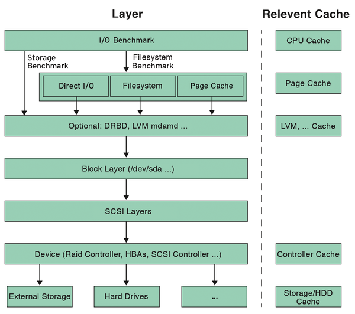

# [Linux FileSystem 回顾](https://zhuanlan.zhihu.com/p/55159881)

centos7.0开始默认文件系统是xfs，centos6是ext4，centos5是ext3

ext3和ext4的最大区别在于，ext3在fsck时需要耗费大量时间（文件越多，时间越长），而ext4在fsck时用的时间会少非常多
fsck（file system check）用来检查和维护不一致的文件系统。若系统掉电或磁盘发生问题，可利用fsck命令对文件系统进行检查

ext4是第四代扩展文件系统（英语：Fourth EXtended filesystem，缩写为ext4）是linux系统下的日志文件系统，是ext3文件系统的后继版本
ext4的文件系统容量达到1EB，而文件容量则达到16TB，这是一个非常大的数字了。对一般的台式机和服务器而言，这可能并不重要，但对于大型磁盘阵列的用户而言，这就非常重要了。
ext3目前只支持32000个子目录，而ext4取消了这一限制，理论上支持无限数量的子目录

xfs是一种非常优秀的日志文件系统，它是SGI公司设计的。xfs被称为业界最先进的、最具可升级性的文件系统技术
xfs是一个64位文件系统，最大支持8EB减1字节的单个文件系统，实际部署时取决于宿主操作系统的最大块限制。对于一个32位Linux系统，文件和文件系统的大小会被限制在16TB
xfs在很多方面确实做的比ext4好，ext4受限制于磁盘结构和兼容问题，可扩展性和scalability确实不如xfs，另外xfs经过很多年发展，各种锁的细化做的也比较好。

接下来的文件打洞(Hole Punching) 实验涉及到稀疏文件(sparse file) 和 文件打洞(hole punching) 两个概念，需要操作系统和文件系统的支持。至少使用 ext4 或者 XFS 进行测试。

# [Hole Punching](http://blog.jcix.top/2018-09-28/hole_punching/)

## Create Sparse File (稀疏文件)

实验参考 [Linux File Hole](https://www.halolinux.us/kernel-reference/file-holes.html)
实现Linux文件打洞(Make a hole), 这样会给该文件预留一定的空间。
例如, `datahole.c` 写出了这样一个文件: `[DataSize 4K][HoleSize 12K][DataSize 4K][HoleSize 12K][DataSize 4K]`
其中，Block hole 只有在发生读写的时候，文件系统才会触发Block的分配。
`ls` 查看该文件的时候显示，该文件Size 为 36K， 但是第一列显示的实际占用磁盘却只有12K。

```
# ls -lsh /tmp/file.hole
12K -rw------- 1 root root 36K Oct 27 10:55 /tmp/file.hole
```

## Hole Punching

实验中调用`fallocate(fd, FALLOC_FL_PUNCH_HOLE | FALLOC_FL_KEEP_SIZE, 409600, 1024000)` 实现将 `/tmp/file_withhole` 文件的 400K 到1000K的磁盘存储空间释放，实现Hole Punching

```
# ls -lsh
  12K -rw------- 1 root   root     36K Oct 27 11:28 file.hole
1000K -rwxr-xr-x 1 root   root   1000K Oct 27 11:26 file_nohole
 400K -rwxr-xr-x 1 root   root   1000K Oct 27 11:26 file_withhole
```

# [Disk block sizes vs File system block sizes](http://www.linuxintro.org/wiki/Blocks,_block_devices_and_block_sizes)

* Disk block size: Hard disk 的Block 大小不能小于 512 bytes（测试结果为 512 bytes）

```
# dd if=/dev/sda1 of=/dev/null count=1
1+0 records in
1+0 records out
512 bytes (512 B) copied, 0.000131684 s, 3.9 MB/s
```

* File system block size: 操作系统存储文件时，分配的最小单位，默认为 4096 bytes/block, 也就是当我们只存储几个byte的文件，操作仍然需要申请和分配一个Block(4096 bytes)，其对应 8个 Disk blocks。

```
# echo 'abc' > small_file

# ls -lsh small_file
4.0K -rw-r--r-- 1 root root 4 Oct 27 12:57 small_file

# stat small_file
  File: ‘small_file’
  Size: 4         	Blocks: 8          IO Block: 4096   regular file
Device: fd00h/64768d	Inode: 17595205    Links: 1
Access: (0644/-rw-r--r--)  Uid: (    0/    root)   Gid: (    0/    root)
Access: 2021-10-27 12:57:06.381419882 +0800
Modify: 2021-10-27 12:57:06.381419882 +0800
Change: 2021-10-27 12:57:06.381419882 +0800
 Birth: -

# stat -f small_file
  File: "small_file"
    ID: fd0000000000 Namelen: 255     Type: xfs
Block size: 4096       Fundamental block size: 4096
Blocks: Total: 4452864    Free: 2483950    Available: 2483950
Inodes: Total: 8910848    Free: 8746713
```

